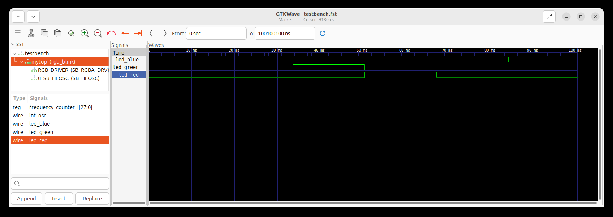

The blink led is used to blink the led in different colours, by blinking one colour at a time.
The order of the led colour blinking is white, red, green, blue, cyan, yellow, purple and black. Each colour blinks for 0.7 seconds.
It could be used to factory test the LEDs, whether they are working properly or not.

