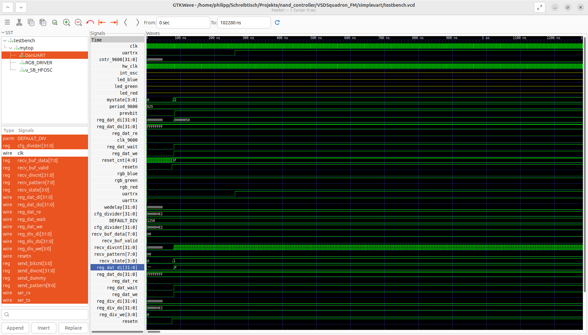

# What it does

The simpleuart is a controller that accepts commands from the PC keyboard. This is realized by using the FTDI FT232H chip on the VSD-Squadron which translates the USB protocol to the UART protocol on the FPGA. It parses those inputs and plays with the output. The LED is controlled by the keys 0,1,2,3,4,5,6,7 on the keyboard: 0 is black, 1 is red, 2 is yellow, 3 is green, 4 is white, 5 is blue, 6 is cyan, 7 is violet.
When you press any other character, the next character is printed, e.g. when you press "a" you get a "b", when you pres "b" you get a "c", ...

The engineering samples of the VSDSquadron had a too strong resistor in front of the LEDs, which had the effect that only one of the 3 LEDs (red, green or blue) could light up at a time, usually red had preference.
It could be used to factory test the LEDs, whether they are working properly or not.

# Simulation

To run a simulation of the project you need to have iverilog and gtkwave installed, to install them you can use the following command:
```sudo apt install iverilog gtkwave```

To run the simulation you can use the test target in the makefile:
```make test```

This command compiles the  from SystemVerilog, then runs the simulation. The simulation writes the waveform to the file waveform.fst which is then opened in gtkwave for viewing:


